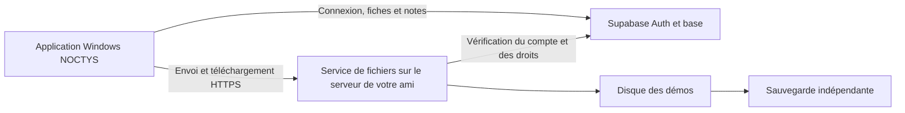

# Démos sur server

Cette solution est proposée pour NOCTYS et ses neuf membres. **Aucun serveur externe n’est encore installé ni connecté à NOCTYS HQ 0.2.2.** La version actuelle envoie les fichiers dans Supabase Storage. Changer une URL dans Supabase ne suffit pas à déplacer les démos.

## Proposition pour une intégration dans NOCTYS

Conserver Supabase Free pour les comptes, rôles, calendriers et fiches de démos. Stocker les fichiers `.dem` sur les disques du serveur de votre ami, accessibles par un service HTTPS. Les gros fichiers ne transiteraient plus par Supabase Storage : ses limites de taille et de capacité ne s’appliqueraient donc plus à ces fichiers ; les quotas Auth et base de données resteraient applicables.

Le joueur utiliserait son compte NOCTYS habituel. Un coach ou analyste déposerait une démo depuis l’application, puis tous les membres actifs pourraient la télécharger. Les notes et informations du match resteraient synchronisées dans Supabase.

Une mise en œuvre possible utilise Docker, un reverse proxy HTTPS et **tusd** pour les envois avec reprise. tusd sait stocker sur disque ; son système de hooks permet de contrôler la création des transferts. Il faut aussi un service d’autorisation qui vérifie le JWT Supabase, le membre actif et son rôle sur chaque opération, y compris reprise, téléchargement et suppression. Les hooks de création seuls ne protègent pas toutes ces opérations. Le port tusd et le répertoire des fichiers doivent rester privés derrière ce service.

L’intégration à développer comprend le choix du fournisseur de stockage dans les fiches, les transferts vers ce service, la reprise après interruption, les téléchargements autorisés et la conservation de l’accès aux anciennes démos Supabase. Aucun secret administrateur n’est à intégrer à l’exécutable. Les fichiers reçoivent des identifiants uniques ; les noms fournis par les utilisateurs ne deviennent pas directement des chemins disque.

## Variante disponible plus rapidement : Nextcloud

Si vous possèdez déjà Nextcloud, créer un espace partagé privé NOCTYS avec neuf comptes individuels et des droits d’écriture réservés au staff permet de commencer à échanger des démos. Le client de synchronisation Nextcloud transfère les gros fichiers par morceaux. L’administrateur doit prévoir les limites de son serveur web, les quotas et l’espace temporaire.

Cette variante s’utilise d’abord dans Nextcloud et demande des comptes Nextcloud distincts. Elle ne connecte pas automatiquement l’onglet Demo analyzer ni la session Supabase. Une intégration WebDAV dans NOCTYS constituerait un travail supplémentaire. Éviter de synchroniser toute la bibliothèque sur les neuf PC si les joueurs n’ont besoin que de quelques matchs.

## Mise en service après vérification du serveur

1. Confirmer le système, le disque, le débit montant, le domaine et qui administre le serveur. Ne pas envoyer les mots de passe dans le chat.
2. Choisir entre Nextcloud pour le partage immédiat et le service intégré pour conserver une seule connexion NOCTYS.
3. Installer et adapter la solution choisie, fixer une limite de fichier et un quota total, configurer la sauvegarde et les alertes d’espace disque.
4. Tester avec un coach et un joueur : gros transfert interrompu puis repris, téléchargement complet, accès refusé à un compte en attente, vérification d’intégrité et restauration d’un fichier sauvegardé.
5. Publier une nouvelle version Windows après validation de l’intégration. Conserver les anciennes démos jusqu’à vérification de leur migration.

Documentation consultée le 16 septembre 2026 : [tusd et stockage local](https://tus.github.io/tusd/storage-backends/local-disk/), [hooks tusd](https://tus.github.io/tusd/advanced-topics/hooks/), [validation des JWT Supabase](https://supabase.com/docs/guides/auth/jwts), [gros fichiers Nextcloud](https://docs.nextcloud.com/server/latest/admin_manual/configuration_files/big_file_upload_configuration.html).
